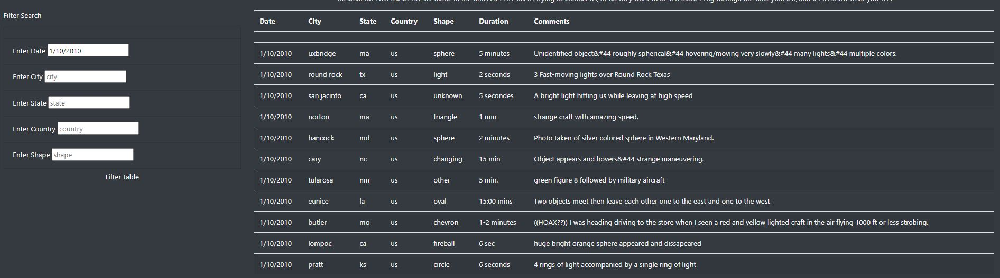

# UFOs

## Purpose of the Project:

- The purpose of the project is to build a website to assist Dana in displaying the list of data presented in the data.js file, and to create a usable filter that easily sorts and lists the data based on the information entered in the website. Filters created were Date, City, State, Country, and Shape. 

## Results
- A search bar has been created on the left side of the website. It is where the user can easily entered the searches of their interest. The following screenshot shows the webpage without any filters entered. 

- The user can enter any filtering criteria in the columns on the left hand side of the website. For instance, the following screenshot shows the list of data after a date of 1/10/2010 was entered in the filtering column. 

- Notice that the list of data on the righthand side now only shows data with a date of 1/10/2010. The filters would also work with specific City, State, Country, and Shape. 

## Summary

### Drawbacks
- One of the drawback is that the user must enter the filters exactly as shown in the data. If the user enters a city name with a upper case letter, the data would not shown. 
- Another drawback is the lack of a clear all button in the website. Once a filter has successfully executed, there is no way the user can go back to the full list, except by refreshing the page. 

### Recommendations
- The first recommendation would be adding a "Clear Criteria" button in the website. This would allow the user the return to the beginning of the search. 
- The second recommendation is a dropdown list, which shows the user a list of inputs that can be entered in the filtering boxes. This would eliminate any case-sensitive errors mentioned previously. 
