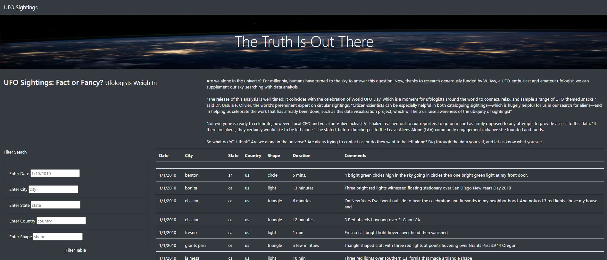

# UFOs

## Purpose of the Project:

- The purpose of the project is to build a website to assist Dana in displaying the list of data presented in the data.js file, and to create a usable filter that easily sorts and lists the data based on the information entered in the website. Filters created were Date, City, State, Country, and Shape. 

## Results
- A search bar has been created on the left side of the website. It is where the user can easily entered the searches of their interest. The following screenshot shows the webpage without any filters entered. 

